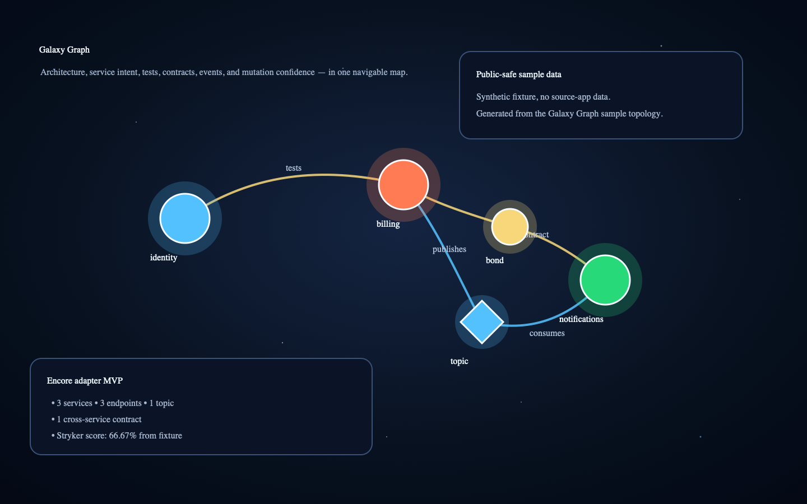

# Galaxy Graph

<div align="center">

**Backend architecture, service intent, test confidence, contracts, events, and mutation score — rendered as an interactive galaxy.**

[](#verification)
[](#packages)
[](LICENSE)
[](https://www.typescriptlang.org/)
[](#adapters)

</div>



> **Status:** pre-public beta. The repo is now package-shaped, tested, documented, and CI-ready locally, but GitHub/npm publishing still needs explicit maintainer approval.

## Why this exists

Modern backend systems hide important product knowledge in places that are hard to scan together:

- framework service declarations;
- endpoint handlers;
- cross-service contracts;
- event topics;
- test names and stories;
- mutation testing reports;
- JSDoc/TSDoc intent comments.

Galaxy Graph turns those signals into a navigable architecture map. Core rendering stays backend-agnostic; adapters convert source trees and reports into a normalized dataset.

## Packages

- `@galaxy-graph/core` — React + Three.js graph renderer, normalized schema, and public-safe sample data.
- `@galaxy-graph/adapters` — Encore, Stryker, and semantic JSDoc/TSDoc extraction utilities.
- `@galaxy-graph/cli` — `galaxy-graph generate` command for producing graph JSON from a repo.
- `@galaxy-graph/example-basic` — minimal Vite app that renders the sample graph.

## Quick start

```bash
git clone https://github.com/BenSheridanEdwards/galaxy-graph.git
cd galaxy-graph
npm ci
npm run build
npm test
npm run dev
```

Open the Vite URL printed by `npm run dev` to view the sample galaxy.

## CLI usage

Generate a normalized dataset from an Encore backend:

```bash
npx galaxy-graph generate \
  --adapter encore \
  --root /path/to/your/repo \
  --out galaxy-graph.json
```

Current Encore defaults:

- services: `backend/systems/**/encore.service.ts`
- endpoints: exported `api(...)` declarations
- topics: `backend/events/*.ts` with `new Topic(...)`
- contracts: `backend/systems/_contracts/*.ts`
- tests: `*.test.ts` / `*.contract.*` files with optional semantic JSDoc
- mutation report: `reports/mutation/mutation.json`

## React usage

```tsx
import { GalaxyGraph } from "@galaxy-graph/core";
import "@galaxy-graph/core/style.css";

export function ArchitectureView() {
  return <GalaxyGraph />;
}
```

The default render uses a small synthetic sample dataset. Apps can later pass generated datasets through the package API rather than importing app-specific generated files.

## Adapters

Adapters emit the normalized `GalaxyGraphDataset` schema. The current MVP includes:

- **Encore adapter** — discovers services, endpoints, topics, contracts, and contract tests from TypeScript source.
- **Stryker adapter** — aggregates mutation reports by service and maps file-level mutation results to endpoint keys where source context is available.
- **JSDoc/TSDoc semantic extractor** — turns human intent comments into node narratives.

Supported tags:

```ts
/**
 * Human-readable body text.
 * @summary One-line purpose.
 * @why Why this exists architecturally/product-wise.
 * @flow Step-by-step flow.
 * @since Optional version/date marker.
 * @story Test/contract story.
 * @category contract | resilience | behaviour | edge-case | ...
 */
```

See [`docs/schema.md`](docs/schema.md) and [`docs/adapters.md`](docs/adapters.md).

## Verification

Local checks expected before release:

```bash
npm ci
npm run build
npm run typecheck
npm test
npm audit --audit-level=moderate
npm run pack:dry-run
```

The repo includes `.github/workflows/ci.yml` with the same checks. Badges that depend on GitHub Actions and npm publication are intentionally marked pre-public until the remote/package exists.

## Public-readiness notes

What is ready now:

- monorepo package structure;
- sanitized sample data and fixture data;
- MIT license;
- contributor/security/changelog docs;
- CI workflow file;
- unit and smoke tests for schema, JSDoc, Stryker, Encore fixture parsing, and CLI output;
- npm package metadata and dry-run packing scripts.

Remaining launch caveats:

- the demo asset above is a generated public-safe SVG from the sample topology, not a browser screenshot; browser capture was not reliable in this sandbox;
- Encore support is an MVP, not full framework parity;
- endpoint-level mutation mapping is file-based and should become line/function-aware;
- npm package names and GitHub URLs should be confirmed before publish.

## Roadmap

- Framework adapters: Express, NestJS, FastAPI/OpenAPI.
- Line-aware Stryker mapping to endpoint/function ranges.
- Dataset import prop/API for app-owned generated JSON.
- AI-assisted JSDoc/TSDoc authoring command.
- Hosted demo page after GitHub publication.

## License

MIT © Ben Sheridan Edwards.
